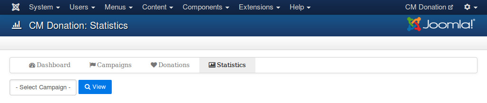
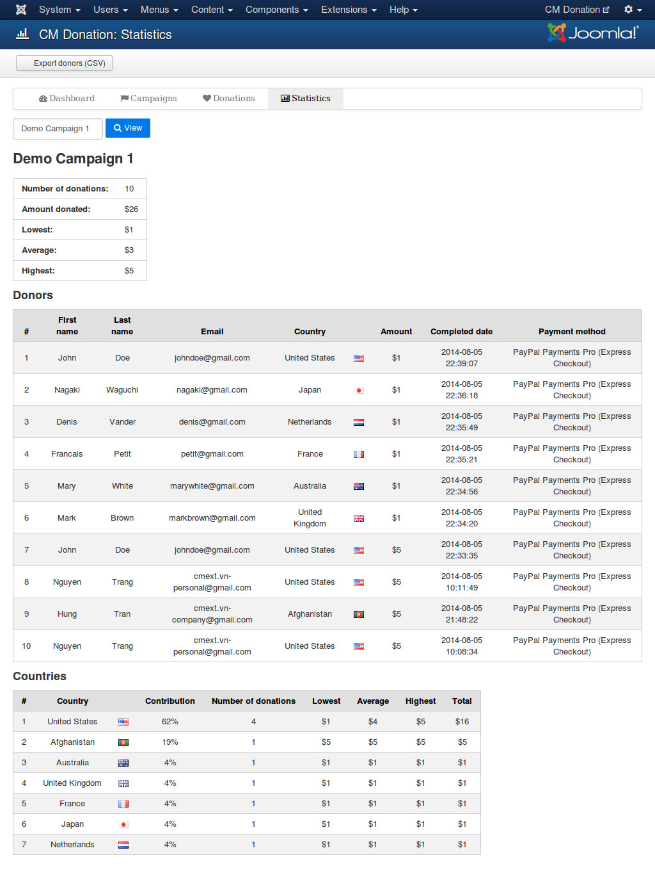
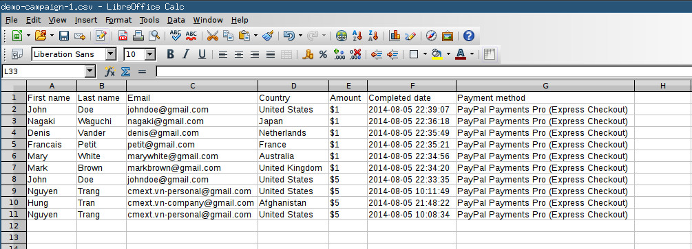

=======================
Statistics in back-end
=======================

To view statistics of your campaigns, you go to Extensions -> CM Donation in your Joomla!'s back-end.

.. image:: ../images/cmdonation_menu.jpg

On CM Donation's Dashboard page, you click "Statistics" on the toolbar.

.. image:: ../images/cmdonation_dashboard.jpg

Select the campaign you want to view its statistics then click "View" button.

In the next page the statistics are displayed similar to the screenshot below.

If you want to export the list of donors of this campaign, you click the button "Export donors (CSV)" on the toolbar. Download the CSV file and open it with your favorite spreadsheet application which supports CSV.

