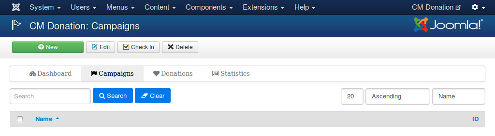
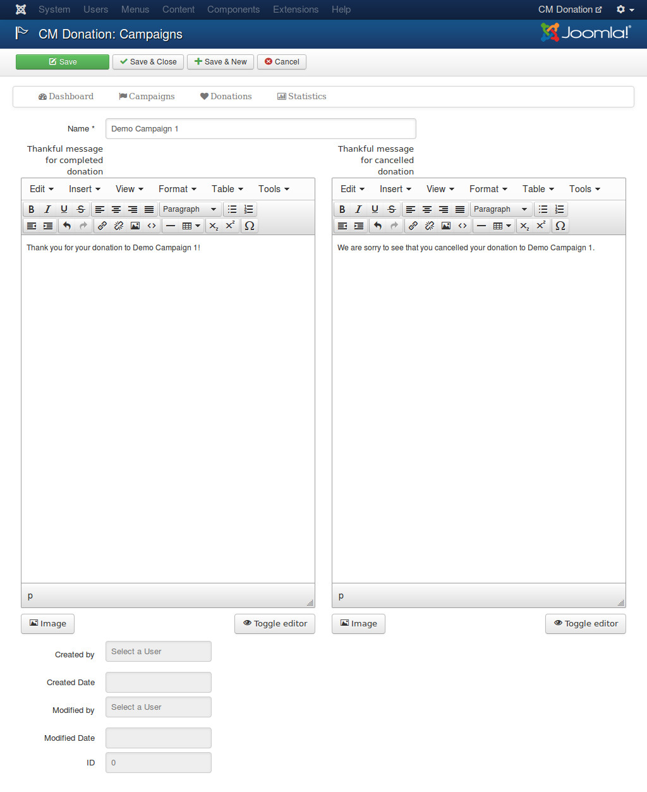
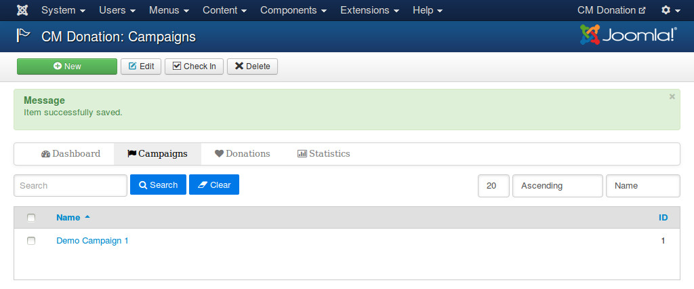
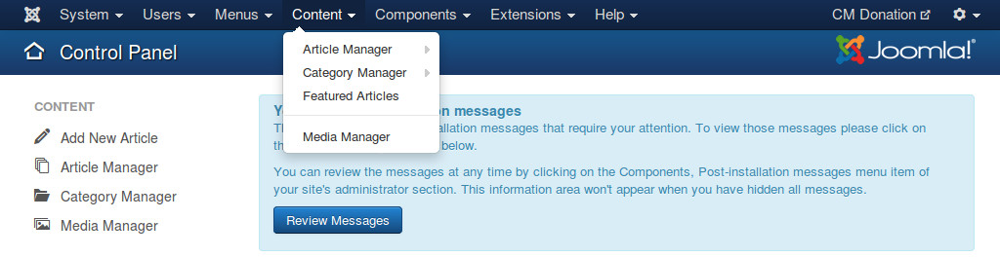
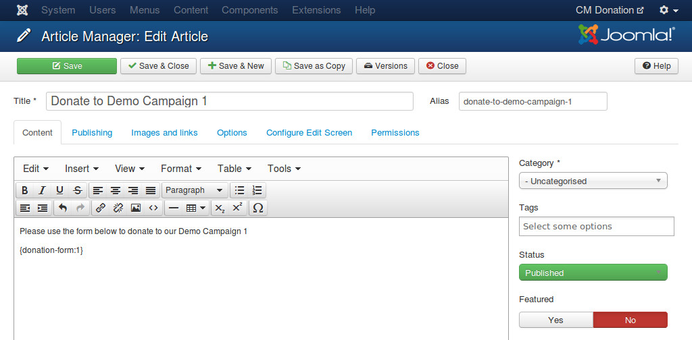
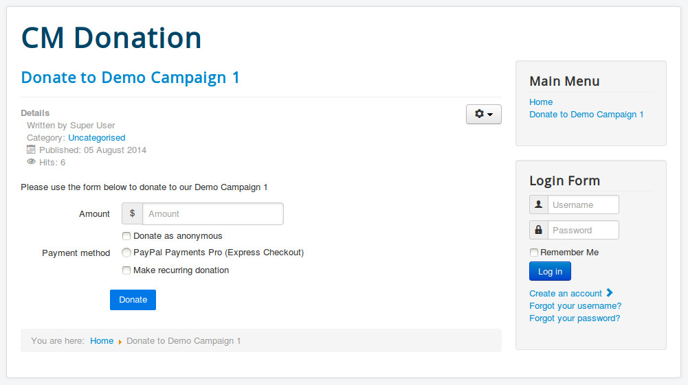

=========
Campaigns
=========

Create new campaign
^^^^^^^^^^^^^^^^^^^

To create a new campaign, you navigate to Extensions -> CM Donation in your Joomla!'s back-end.

.. image:: ../images/cmdonation_menu.jpg

On CM Donation's Dashboard page, you click "Campaigns" on the toolbar.

.. image:: ../images/cmdonation_dashboard.jpg

In the list of campaigns, you click "New" button on the toolbar to create a new campaign.

In there form, there are 3 fields you need to provide information:

* **Name**: The name of the campagain you want to create.
* **Thankful message for completed donation**: Your thankful message to donor, this message is displayed after donor makes a successful donation on payment service's website (eg. PayPal).
* **Thankful message for cancelled donation**: Your thankful message to donor after donor cancels donation, this message is displayed after donor cancels donation on payment service website.

Other fields in the form:

* **Created by**: The user who creates the campaign.
* **Created date**: The date when the campaign is created.
* **Modified by**: The user who makes the last modification for the campaign.
* **Modified date**: The date when the last modification is made.
* **ID**: The ID of the campaign.

After your new campaign is saved successfully, you are taken back to the campaign list.

In the list, there is a column for campaign ID, you will need campaign ID for display campaign's donation form or other statistic information.

Display campaign's form
^^^^^^^^^^^^^^^^^^^^^^^^

To allow people to donate to your campaign you need to display the campaign's donation form on your site.

In your Joomla!'s back-end you go to Content -> Article Manager. If you want to display the form in an existing article, you edit that article, otherwise you create a new article.

In the content of your article, you enter the tag (shortcode)

{donation-form:X}

where you want the form to be displayed. X is the ID of the campaign you want to display its form.

Visit your article on your site's front-end, you can see the donation form is displayed in your article.

