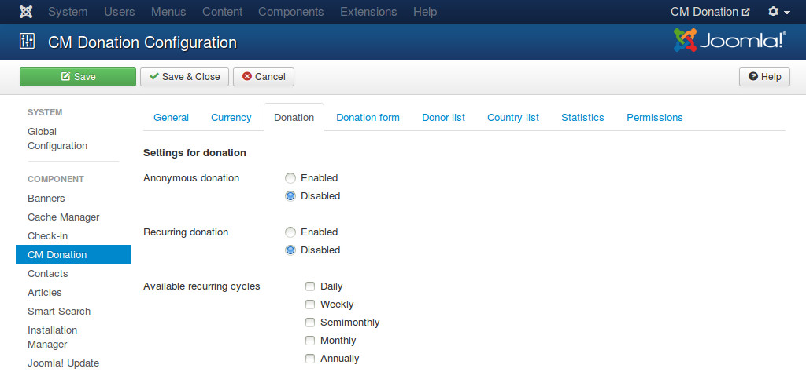
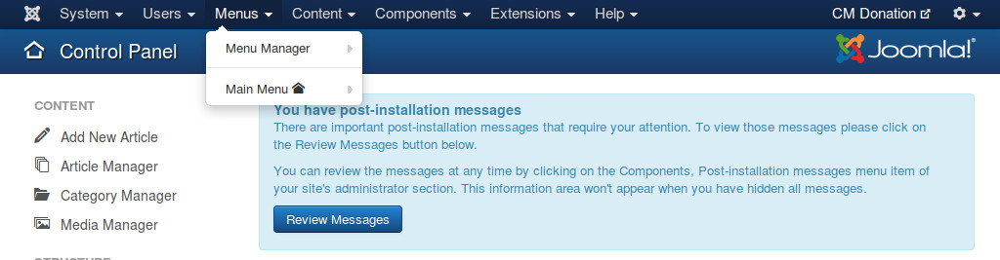
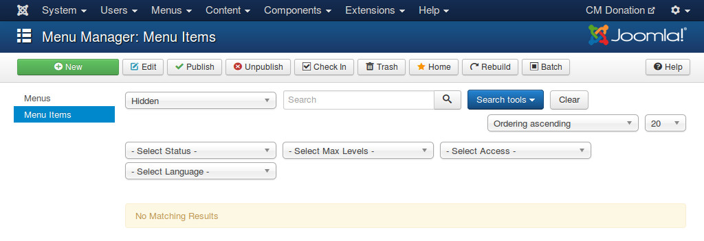

=============
Configuration
=============

CM Donation component
=====================

In your Joomla!'s back-end, you go to Extensions -> CM Donation to access CM Donation component.

The default page of CM Donation is the dashboard. On the toolbar there is an "Options" button, you click this button to configure the component.

There are the following tags in the configuration page: General, Currency, Donation, Donation form, Donor list, Country list, Statistics, Permission.

General
^^^^^^^

In "General" tab, we have the following options:

* **Row number column**: Show or hide the first column for row number in statistic tables (top donors, latest donations,...).
* **Date format**: Date format which is used in both front-end and back-end.

Currency
^^^^^^^^

In "Currency" tab, we have the following options to configure the currency used in donation:

* **Currency sign**: The sign of the currency you use for donation. For example, "$" for United States Dollar.
* **Currency sign position**: Where currency sign is displayed, before or after the amount.
* **Decimals**: Number of decimals.
* **Decimal point**: Character is used as decimal point.
* **Thousands separator**: Character is used as thousands separator.

Donation
^^^^^^^^

In "Donation" tab, we have the following configuration for donation:

* **Anonymous donation**: Allow anonymous donation.
* **Available recurring cycles**: Available recurring cycles which are displayed in donation form for donor to select. If there is only 1 cycle available, this option is hidden.

Donation form
^^^^^^^^^^^^^

In "Donation form" tab, we have an option for donation form:

* **Hide lone payment option**: Hide payment method selection if in donation form there is only 1 payment method to select.

Donor list
^^^^^^^^^^

In "Donor list" tab, we have the following configuration for top donor and latest donation tables:

* **Donor name**: How donor name is displayed, you can show first name or last name only, or display both.
* **Country**: Hide country info or display country as flag or name or both flag and name.
* **Donated date column**: Show or hide donated date column.

Country list
^^^^^^^^^^^^

In "Country list" tab, we have the following configuration for country table:

* **Country info**: Show country name or country flag, or show both.
* **Contribution percentage column**: Show or hide the column for contribution percentage of country.
* **Contribution percentage's decimals**: Number of decimals of contribution percentage.
* **Lowest amount column**: Show or hide the column for lowest donated amount of country.
* **Average amount column**: Show or hide the column for average donated amount of country.
* **Highest amount column**: Show or hide the column for highest donated amount of country.

Statistics
^^^^^^^^^^

In "Statistics" tab, there are options for reports and CSV export:

* **Country info**: Show or hide country info in statistics and CSV file.
* **CSV delimiter**: The character used to separate fields.
* **CSV enclosure character**: The character used to enclose field.

**Note**: If you show country info (name, flag or both name and flag), only country name is displayed in CSV file.

Permissions
^^^^^^^^^^^

You should change the options in "Permissions" tab if you have many user groups which can access your Joomla! back-end and you need to give them different permissions. If you are the only administrator on the site, or only administrators can access your back-end, you don't need to configure these settings.

You can view `Access Control List Tutorial <http://docs.joomla.org/J2.5:Access_Control_List_Tutorial>`_ for more understand how Joomla!'s access control list works.

CM Donation Content plugin
==========================

To configure CM Donation Content plugin, you navigate to Extensions -> Plugin Manager.

You search for "CM Donation Content plug-in".

Click on its name and you are taken to the page as the screenshot below where you can edit its settings.

Because all the information of your campaigns is displayed in Joomla! articles and any place supporting Joomla! Content event (third party extensions, modules...), so everytime a page is loaded, the plugin must search and check if there is any information that you ask to display. The information could be

* Number of donations
* Total amount donated
* Donation form
* Latest donations
* Top donors
* Top countries

If there is any information that you don't need to display on your site, you should ask the plugin to stop checking for them to speed up your page load. You can do this by switching the option of the information to "Disabled" in the plugin's setting page.

You need to enable the plugin otherwise it doesn't run.

.. _ref-paypal-payment-pro:

PayPal Payments Pro plugin
==========================

In Plugin Manager you search for PayPal Payments Pro payment plugin. Its name in the list is "CM Donation - PayPal Payments Pro (Express Checkout) payment plugin". Click on the plugin name to configure it.

In "Payment option title" you enter your custom name for this payment method, this is displayed in donation form. If you leave this field empty, the name "PayPal Payments Pro (Express Checkout)" will be used.

If you want to use PayPal Sandbox for testing, you switch "Sandbox" option to "Yes" and enter your API username, API password, and API signature of your PayPal Sandbox into "Sandbox API Username", "Sandbox API Password", "Sandbox API Signature" fields.

If you want to accept real transactions, you set "Sandbox" to "No" and enter your PayPal's info into "API Username", "API Password", "API Signature" fields.

You need to select the currency that is used in your donations in "Currency" option. You only can select the currency that PayPal's supported. Please note that your PayPal account must also support the selected currency.

With "Locale" option, you can select the language of PayPal's transaction page. If your site is a multilanguage site, you can use the Joomla!'s' locale that donor uses. For example, if your site is in English and French, donor views your site in French and decides to donate, French is the locale of PayPal's donation page after donor is taken to PayPal. If your site is only in 1 language, you should choose another option in the list.

Please remember to enable the plugin.

Create menu item
================

CM Donation component only provides one menu item for Thank You page. This is the page where thankful messages to donor are displayed.

Without menu items for Thank You page, CM Donation still can display thankful pages with no problem, however the addresses of these pages are not nice and user friendly. By creating menu items, you can customize the addresses with the aliases of the menu items.

Because these pages are only available after donor completes or cancels a donation, so we don't want these pages to be visible to public. To do this you need to put them into a menu which is not assigned to any menu module, so the menu and the menu items will not be displayed anywhere on your site.

You navigate to Menu -> Menus Manager.

Click "New" button on the toolbar to create a new menu.

Give you menu a name and a menu type, for example "Hidden".

Save the menu and you are taken back to the menu list.

Select this new menu in the menu list, you can see there is no menu items in this menu at the moment, you click "New" button on the toolbar to create a new menu item.

In the next form, you click "Select" button to select menu item type.

In the pop-up, you select CM Donation -> Thank you.

Give your new menu item a new and select "Complete" in "Layout" option to configure this new menu item for completed donation.

Save your new menu item and it is displayed in the list.

Create another new menu item for "Cancel" layout, this menu item is for cancelled donation.

Now you have 2 hidden menu items for thankful messages of completed donation and cancelled donation.

