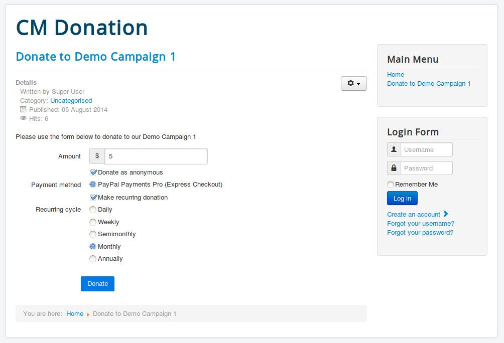
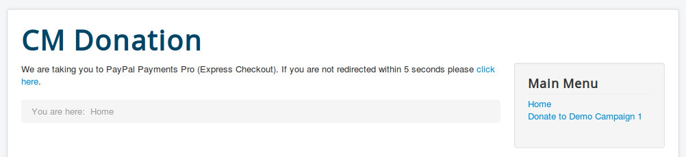
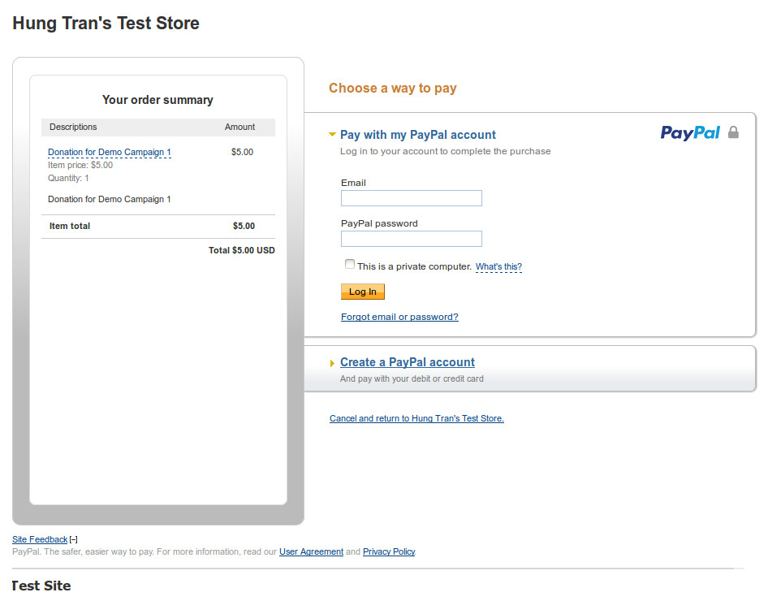
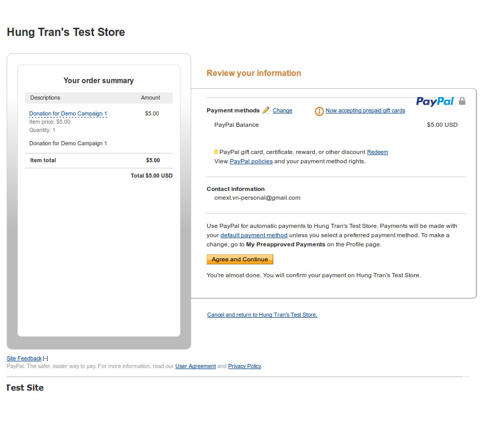
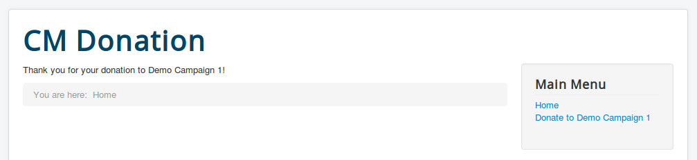
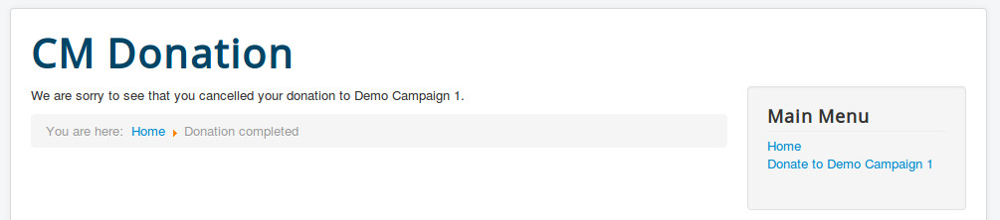

======
Donate
======

Before test your donation form, please make sure that you have already enabled and configured :ref:`ref-paypal-payment-pro`.

Enter the amount you want to donate, select the options in the form and click "Donate" button.

If there is no validation errors, you will be taken to PayPal to complete the transaction.

On PayPal website, you can login with your PayPal account or use your credit card to donate.

You follow the next steps to complete your transaction.

If your transation is completed successfully, you will be taken to the menu item for completed donation.

If you cancel the transaction by clicking the link "Cancel and return to..." at the bottom of the page, you will be taken to the menu item for cancelled donation.

