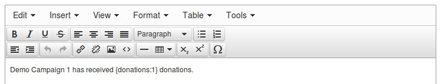
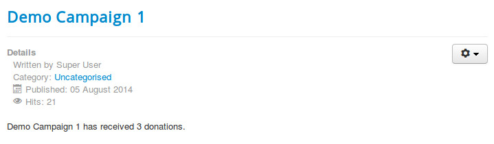
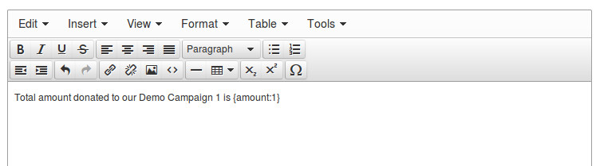
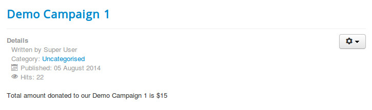
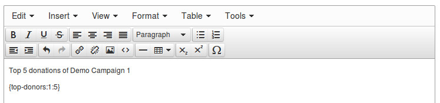
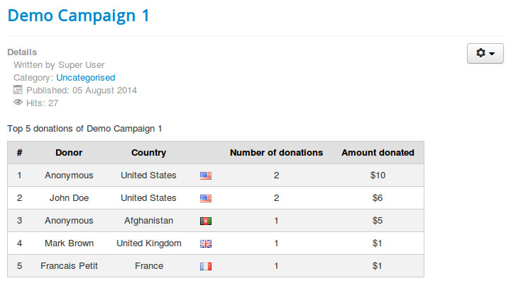
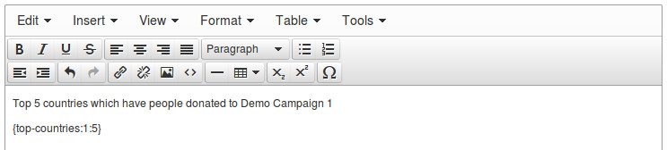
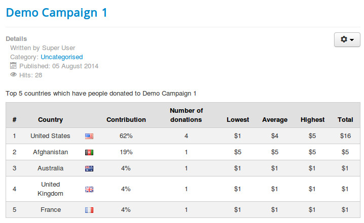

=======================
Statistics in front-end
=======================

You can display the following information in your front-end:

* The number of donations of a campaign.
* Total amount donated of a campaign.
* Latest donations of a campaign.
* Top donors of a campaign.
* Top countries of a campaign.

Donation quantity
=================

Edit the Joomla! article which you want to display donation quantity of your campaign, you put the tag

{donations:X}

where you want the number is displayed. X is the ID of the campaign.

View the article in front-end to check if the number of donations is displayed.

Total amount donated
====================

To display the total amount that donors donated to your campaign, you put the tag

{amount:X}

where you want to display the value in your article. X is the ID of the campaign.

The tag will be replaced by the value of your campaign's total amount of donated money.

Latest donations
================

You can display the latest donations of your campaign by putting the tag

{latest-donations:X:Y}

where you want to display the value in your article. X is the ID of the campaign and Y is the number of donations you want to display.

The tag will be replaced by the value of your campaign's total amount of donated money.

Top donors
==========

A donor can donate to your campaign many times. You can hornor the donors by listing them in top donors table. You use the tag

{top-donors:X:Y}

where you want to display the table. X is the ID of the campaign and Y is the number of donors you want to display.

The plugin automatically calculates the donor's contributions and display the donors who contributed the most on the top of the list.

Top countries
=============

We can know where donors come from via the PayPal transactions. The plugin can collect this data and make a statistic table to listing what countries that have donors contributing to your campaign the most. The tag for this table is

{top-countries:X:Y}

where you want to display the table. X is the ID of the campaign and Y is the number of countries you want to display.

The result in your article similar to the following screenshot.

