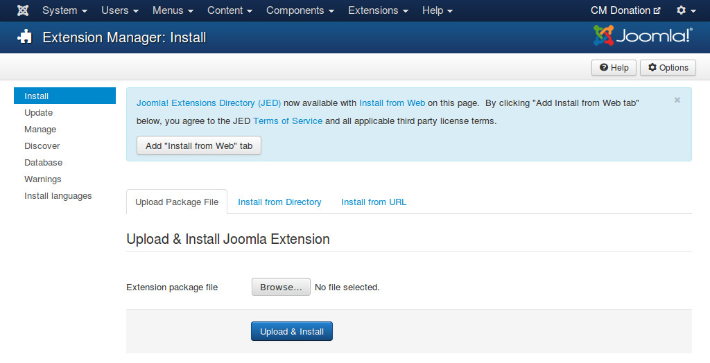
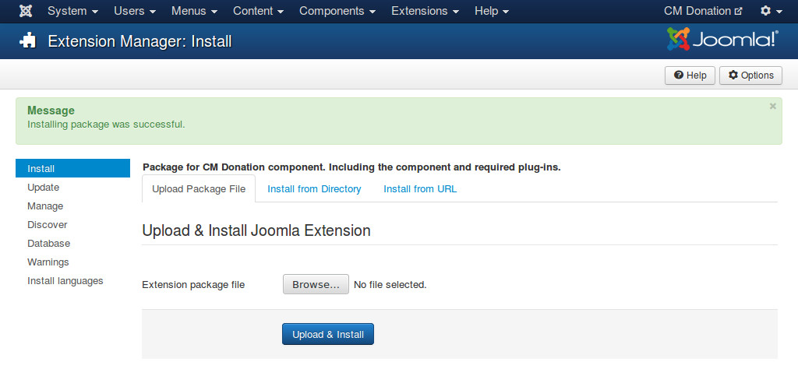

============
Installation
============

Download
--------

The installation package of CM Donation can be downloaded from `our website <http://cmext.vn>`_ or from `our Github repository <https://github.com/cmextension/cmdonation>`_.

The package includes:

* CM Donation component
* CM Donation Content plugin
* PayPal Payments Pro (Express Checkout) payment plugin

Installation
------------

In your Joomla! back-end, you navigate to Extensions -> Extension Manager

.. image:: ../images/installation_menu.jpg

Click "Browse" button and select the installation package of CM Donation on your computer, click "Upload & Install" button to upload the package to your server and install it.

If the package is installed successfully, you receive the message "Installing package was successful."

You can see CM Donation in Components menu item.

.. image:: ../images/cmdonation_menu.jpg

Go to Extensions -> Plugin Managers,  you can see CM Donation Content plugin and PayPal payment plugin are also available in the list of installed plugins.

.. image:: ../images/installation_plugins.jpg